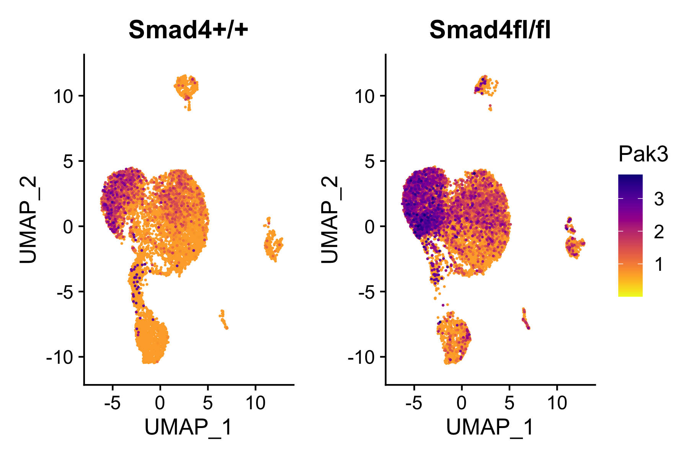

# Smad4 and TGFb1 Gene Expression Scientific Reports 2025, PMID: 40348815
Representative Code for generating figures from the published study "Smad4 and TGFβ1 dependent gene expression signatures in conditional intestinal adenoma, organoids, and colorectal cancer." Surakhy M, et al, 2025. DOI https://doi.org/10.1038/s41598-025-00908-4
