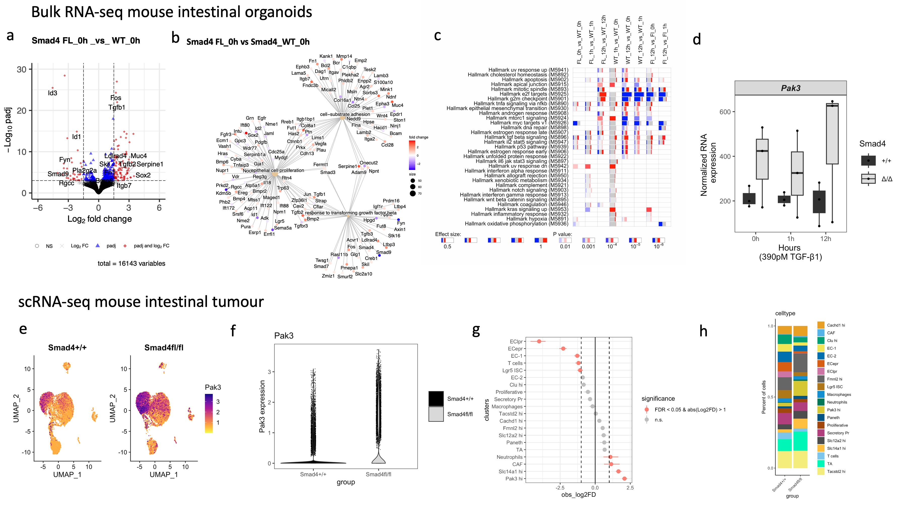

### Smad4 and TGFb1 Gene Expression Scientific Reports 2025, PMID: 40348815
This repository contains representative code used to generate figures and perform data analysis for the publication:
Surakhy, M., Matheson, J., Barnes, D.J. et al. Smad4 and TGFβ1 dependent gene expression signatures in conditional intestinal adenoma, organoids and colorectal cancer. Scientific Reports, 15, 16330 (2025).
DOI: 10.1038/s41598-025-00908-4
